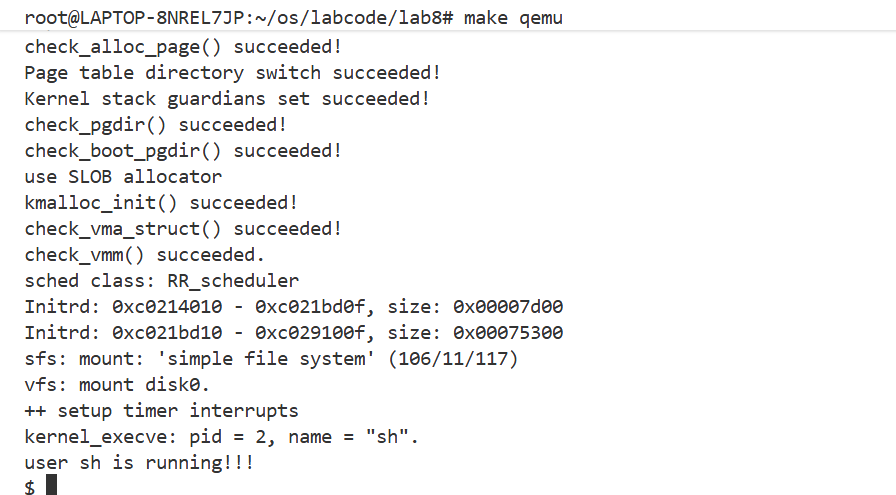
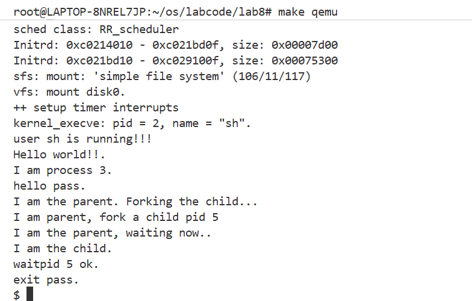

### 练习0：填写已有实验

#### 1.`alloc_proc`函数
在`alloc_proc`函数中，我们新增`proc->filesp = NULL;`来初始化进程的文件描述符表指针为空。

#### 2.`proc_run`函数
在`proc_run`函数中，我们在调用 switch_to() 进行进程上下文切换之前，必须刷新 TLB。所以我们在`        switch_to(&prev->context, &proc->context);`之前添加`flush_tlb();`。

#### 3.`do_fork`函数
在`do_fork`函数中，我们将新增代码
```c
    if (copy_files(clone_flags, proc) != 0)
    { // for LAB8
        goto bad_fork_cleanup_kstack;
    }
```
放在`copy_thread(proc, stack, tf);`之后，以确保在创建新进程时正确复制文件描述符表。

---

### 练习1：完成读文件操作的实现

#### 核心代码实现如下：

```c
// 第(1)部分：处理未对齐的起始块
uint32_t blkoff = offset % SFS_BLKSIZE;
if (blkoff != 0) {
    size_t size = (nblks != 0) ? (SFS_BLKSIZE - blkoff) : (endpos - offset);
    if ((ret = sfs_rbuf(sfs, ino, buf, size, blkoff)) != 0) {
        goto out;
    }
    if (nblks == 0) goto out;
}

// 第(2)部分：处理对齐的完整块
while (nblks > 0) {
    ablock = sfs_bmap_load_nolock(sfs, ino, blkno);
    if ((ret = sfs_rblock(sfs, ablock, buf, SFS_BLKSIZE)) != 0) {
        goto out;
    }
    nblks--, blkno++, buf += SFS_BLKSIZE;
}

// 第(3)部分：处理未对齐的末尾块
if (endpos % SFS_BLKSIZE != 0) {
    ablock = sfs_bmap_load_nolock(sfs, ino, blkno);
    size_t size = endpos % SFS_BLKSIZE;
    if ((ret = sfs_rbuf(sfs, ablock, buf, size, 0)) != 0) {
        goto out;
    }
}
```

我们采用三部分处理算法来处理任意对齐的文件 I/O 操作：

**第(1)部分：处理未对齐的起始块**
- 如果读取起始位置 `offset` 不是块大小的整数倍，需要先从起始块中读取部分数据
- 计算起始块中的偏移量 `blkoff = offset % SFS_BLKSIZE`
- 调用 `sfs_rbuf()` 读取包含起始位置的块
- 从 `blkoff` 位置开始读取，直到块末尾或达到请求数据长度

**第(2)部分：处理对齐的完整块**
- 对于中间的对齐块，可以直接使用块读取操作 `sfs_rblock()`
- 循环读取完整的块直到剩余数据不足一个完整块

**第(3)部分：处理未对齐的末尾块**
- 如果末尾位置 `endpos` 不是块大小的整数倍，需要读取最后一个不完整的块
- 调用 `sfs_rbuf()` 读取最后的块
- 只读取需要的部分数据（从块开始到 `endpos % SFS_BLKSIZE`）

---

### 练习2：完成基于文件系统的执行程序机制的实现

#### load_icode()函数实现步骤如下：

**第(1)步：创建进程内存管理结构**
```c
if ((mm = mm_create()) == NULL) {
    goto bad_malloc;
}
```

**代码解释：**
- 调用 `mm_create()` 函数创建一个新的内存管理结构 `mm_struct`
- 如果创建失败（返回 NULL），跳转到 `bad_malloc` 标签进行清理

---

**第(2)步：设置页目录表**
```c
if (setup_pgdir(mm) != 0) {
    goto bad_pgdir_cleanup;
}
```

**代码解释：**
- 调用 `setup_pgdir()` 为新进程创建页目录表（Page Directory Table）
- 如果设置失败（返回非0），跳转到 `bad_pgdir_cleanup` 进行资源回收

---

**第(3)步：读取并验证 ELF 文件头**
```c
struct elfhdr elf;
if ((ret = load_icode_read(fd, (void *)&elf, sizeof(elf), 0)) != 0) {
    goto bad_elf_cleanup_pgdir;
}
if (elf.e_magic != ELF_MAGIC) {
    ret = -E_LOAD_PHDR;
    goto bad_elf_cleanup_pgdir;
}
```

**代码解释：**
- 定义 `struct elfhdr` 类型的变量 `elf` 用于存储 ELF 文件头信息
- 调用 `load_icode_read()` 从文件描述符 `fd` 的偏移 0 处读取 ELF 文件头
- 读取失败时跳转到 `bad_elf_cleanup_pgdir` 进行清理
- 验证 ELF 魔数 `e_magic` 是否等于 `ELF_MAGIC`（0x464C457F，即 "\x7FELF"）
- 魔数验证失败说明不是有效的 ELF 文件，返回错误码 `-E_LOAD_PHDR` 并清理资源


---

**第(4)步：处理每个 LOAD 程序段**

(4.1) 读取程序头信息：
```c
struct proghdr ph;
off_t phoff = elf.e_phoff + i * elf.e_phentsize;
if ((ret = load_icode_read(fd, (void *)&ph, sizeof(ph), phoff)) != 0) {
    goto bad_segments;
}
```

**代码解释：**
- 定义 `struct proghdr` 类型的变量 `ph` 用于存储程序头信息
- 计算第 `i` 个程序头在文件中的偏移位置：`phoff = e_phoff + i * e_phentsize`
  - `e_phoff`：程序头表在文件中的起始偏移
  - `e_phentsize`：每个程序头的大小
  - `i`：当前处理的程序头索引
- 从计算出的偏移位置读取程序头数据到 `ph` 结构

---

(4.2) 创建虚拟内存映射：
```c
if (mm_map(mm, ph.p_vaddr, ph.p_memsz, prot, flags) != 0) {
    ret = -E_NO_MEM;
    goto bad_segments;
}
```

**代码解释：**
- 调用 `mm_map()` 在进程的虚拟地址空间中创建一个虚拟内存区域（VMA）
- 创建 VMA 后，后续可以按需分配实际的物理页并建立页表映射
- 如果映射失败（返回非0），设置错误码为 `-E_NO_MEM` 并跳转到清理代码

---

(4.3) 分配物理页并读取段数据：
```c
for (addr = ph.p_vaddr; addr < ph.p_vaddr + ph.p_filesz; addr += PGSIZE) {
    struct Page *page = pgdir_alloc_page(mm->pgdir, addr, perm);
    uint32_t poff = addr - ph.p_vaddr;
    uint32_t psize = min(ph.p_filesz - poff, PGSIZE);
    off_t file_offset = ph.p_offset + poff;
    if ((ret = load_icode_read(fd, page2kva(page), psize, file_offset)) != 0) {
        goto bad_segments;
    }
}
```

**代码解释：**
- 遍历段在内存中的虚拟地址范围，按页（PGSIZE = 4KB）进行处理
- `pgdir_alloc_page()`：为虚拟地址 `addr` 分配物理页并建立页表映射，`perm` 指定页表项权限
- 计算当前页对应段内的偏移：`poff = addr - ph.p_vaddr`
- 计算当前页需要读取的数据大小：取 `ph.p_filesz - poff`（剩余数据）和 `PGSIZE`（页大小）的较小值
- 计算文件偏移：`file_offset = ph.p_offset + poff`，即段在文件中的起始位置加上段内偏移
- `page2kva(page)`：将物理页转换为内核虚拟地址，以便写入数据
- 调用 `load_icode_read()` 从文件读取数据到分配的物理页中

---

(4.4) 处理 BSS 段（未初始化数据）：
```c
for (addr = ph.p_vaddr + ph.p_filesz; addr < ph.p_vaddr + ph.p_memsz; addr += PGSIZE) {
    struct Page *page = pgdir_alloc_page(mm->pgdir, addr, perm);
}
```

**代码解释：**
- 遍历范围：从 `ph.p_vaddr + ph.p_filesz`（文件数据结束位置）到 `ph.p_vaddr + ph.p_memsz`（段结束位置）
- 为每个虚拟地址分配物理页并建立页表映射
- `pgdir_alloc_page()` 内部会将新分配的页初始化为 0，

---

**第(5)步：设置用户栈**
```c
uint32_t vm_flags = VM_READ | VM_WRITE | VM_STACK;
if (mm_map(mm, USTACKTOP - USTACKSIZE, USTACKSIZE, vm_flags, 0) != 0) {
    goto bad_segments;
}
mm->user_stack = USTACKTOP - USTACKSIZE;
for (addr = USTACKTOP - USTACKSIZE; addr < USTACKTOP; addr += PGSIZE) {
    pgdir_alloc_page(mm->pgdir, addr, PTE_U | PTE_W);
}
```

**代码解释：**
- 设置栈的虚拟内存区域标志：`VM_READ | VM_WRITE | VM_STACK`，允许读写且标记为栈区域
- 调用 `mm_map()` 在用户空间高地址创建栈的虚拟内存映射
  - `USTACKTOP`：用户栈顶地址（通常是 0x7FFFFFFFF000 或类似的高地址）
  - `USTACKSIZE`：用户栈大小（通常是 4 页 = 16KB）
  - 栈从高地址向低地址增长，所以起始地址是 `USTACKTOP - USTACKSIZE`
- 设置 `mm->user_stack` 记录用户栈的起始地址
---

**第(6)步：将虚拟内存配置应用到当前进程**
```c
mm_count_inc(mm);
if (mm_count_dec(current->mm) == 0) {
    exit_mmap(current->mm);
    put_pgdir(current->mm);
    mm_destroy(current->mm);
}
current->mm = mm;
lcr3(PADDR(mm->pgdir));
```

**代码解释：**
- `mm_count_inc(mm)`：增加新内存管理结构的引用计数
- `mm_count_dec(current->mm)`：减少当前进程旧内存管理结构的引用计数
  - 如果引用计数降为 0，说明没有其他进程共享这个内存空间，需要释放资源：
  - `exit_mmap()`：解除所有虚拟内存映射，释放相关的物理页
  - `put_pgdir()`：释放页目录表占用的物理页
  - `mm_destroy()`：销毁内存管理结构本身
- `current->mm = mm`：将新建的内存管理结构赋给当前进程
- `lcr3(PADDR(mm->pgdir))`：加载新的页目录表基地址到 CR3 寄存器（在 RISC-V 中是 satp）
  - `PADDR()` 将内核虚拟地址转换为物理地址

---

**第(7)步：在用户栈上构建 argc/argv 并配置异常处理框架**

(7.1) 在栈上构建参数结构：
```c
uint32_t argv_size = 0;
for (int i = 0; i < argc; i++) {
    argv_size += strlen(argv[i]) + 1;
}
argv_size += (argc + 1) * sizeof(char *);  

uint32_t stacktop = USTACKTOP - argv_size;
stacktop = ROUNDDOWN(stacktop, sizeof(long));

char **uargv = (char **)(stacktop + argc * sizeof(char *));

char *strings = (char *)(stacktop + (argc + 1) * sizeof(char *));
for (int i = 0; i < argc; i++) {
    uargv[i] = strings;
    strcpy(strings, argv[i]);
    strings += strlen(argv[i]) + 1;
}
uargv[argc] = NULL; 
```

**代码解释：**
- **计算参数所需空间：**
  - 遍历所有参数，累加每个字符串的长度（包括 '\0' 结束符）
  - 加上指针数组的空间：`(argc + 1) * sizeof(char *)`，包括 argc 个指针和一个 NULL 终止符
- **计算栈顶位置：**
  - `stacktop = USTACKTOP - argv_size`：从用户栈顶向下预留参数空间
  - `ROUNDDOWN(stacktop, sizeof(long))`：向下对齐到 long 的大小（RISC-V 要求栈指针 8 字节对齐）
- **构建指针数组：**
  - `uargv` 指向栈上的 argv 指针数组位置
  - `strings` 指向字符串数据的存储位置（紧跟在指针数组之后）
- **复制参数字符串：**
  - 循环遍历每个参数：
    - `uargv[i] = strings`：将指针数组的第 i 个元素指向当前字符串位置
    - `strcpy()`：复制参数字符串到栈上
    - `strings` 指针移动到下一个字符串位置
  - `uargv[argc] = NULL`：数组最后设置 NULL 终止符

---

(7.2) 配置异常处理框架：
```c
struct trapframe *tf = current->tf;

tf->gpr.sp = stacktop;        
tf->gpr.a0 = argc;            
tf->gpr.a1 = (uintptr_t)uargv; 

tf->epc = elf.e_entry;

tf->status = (read_csr(sstatus) | SSTATUS_SPP) & ~SSTATUS_SPP;
tf->status |= SSTATUS_SPIE;
```

**代码解释：**
- `struct trapframe *tf = current->tf`：获取当前进程的异常处理框架（陷阱帧）指针
  - trapframe 保存了从内核返回用户态时需要恢复的所有寄存器状态
- **设置用户态寄存器：**
  - `tf->gpr.sp = stacktop`：设置用户栈指针，指向构建好的参数结构
  - `tf->gpr.a0 = argc`：a0 寄存器存储第一个参数 argc（参数个数）
  - `tf->gpr.a1 = (uintptr_t)uargv`：a1 寄存器存储第二个参数 argv（参数数组指针）
  - 这符合 RISC-V 调用约定：main(int argc, char **argv)
- **设置程序入口点：**
  - `tf->epc = elf.e_entry`：设置异常程序计数器（Exception Program Counter）
  - 从内核返回用户态时，处理器将从这个地址开始执行（通常是程序的 _start 或 main 函数）
- **配置处理器状态：**
  - `(read_csr(sstatus) | SSTATUS_SPP) & ~SSTATUS_SPP`：清除 SPP 位
    - SPP (Supervisor Previous Privilege) = 0 表示返回用户态（U-mode）
    - SPP = 1 表示返回内核态（S-mode）
  - `tf->status |= SSTATUS_SPIE`：设置 SPIE 位
    - SPIE (Supervisor Previous Interrupt Enable) 控制返回后的中断使能状态
    - 设置为 1 表示返回用户态后使能中断

---

#### 辅助函数：load_icode_read()
```c
static int
load_icode_read(int fd, void *buf, size_t len, off_t offset)
{
    int ret;
    if ((ret = file_seek(fd, offset, LSEEK_SET)) != 0)
    {
        return ret;
    }
    size_t copied;
    if ((ret = file_read(fd, buf, len, &copied)) != 0)
    {
        return (ret < 0) ? ret : -1;
    }
    return 0;
}
```

**代码解释：**

我们将原来代码中的`sysfile_read()`和`sysfile_seek()`替换为`file_read()`和`file_seek()`。原因如下：

  `file_read()` 和 `file_seek()` 是内核内部的文件操作接口，可以在内核态直接调用。而 `sysfile_read()` 和 `sysfile_seek()` 是系统调用包装器，需要完整的用户态上下文（mm 结构）。在 `load_icode()` 执行期间，新进程的 mm 正在构建中，还不能使用系统调用接口

---

#### 编译和测试结果

执行 `make qemu` 后，系统成功启动并进入用户 shell（sh），可以执行 hello、exit 等用户程序，表明基于文件系统的程序执行机制实现成功。结果如下图所示：


---

### 扩展练习 Challenge1：完成基于"UNIX的PIPE机制"的设计方案

#### 1. 管道机制概述

UNIX 管道（Pipe）是一种进程间通信（IPC）机制，允许一个进程的输出直接作为另一个进程的输入。管道是单向的、先进先出（FIFO）的字节流，常用于 shell 中的命令组合（如 `ls | grep txt`）。

#### 2. 数据结构设计

##### 2.1 管道核心结构

```c
#define PIPE_BUF_SIZE 4096  // 管道缓冲区大小

// 管道结构体
struct pipe {
    char buffer[PIPE_BUF_SIZE];     // 环形缓冲区
    uint32_t read_pos;              // 读位置指针
    uint32_t write_pos;             // 写位置指针
    uint32_t count;                 // 缓冲区中的数据字节数
    
    // 引用计数
    uint32_t read_open;             // 读端是否打开 (0/1)
    uint32_t write_open;            // 写端是否打开 (0/1)
    
    // 同步互斥机制
    semaphore_t mutex;              // 互斥信号量，保护缓冲区操作
    semaphore_t not_full;           // 条件信号量，缓冲区非满
    semaphore_t not_empty;          // 条件信号量，缓冲区非空
    
    wait_queue_t read_queue;        // 读等待队列
    wait_queue_t write_queue;       // 写等待队列
};
```

##### 2.2 管道文件结构

```c
// 管道的 inode 扩展结构
struct pipe_inode_info {
    struct pipe *pipe;              // 指向管道结构
    int mode;                       // 打开模式：O_RDONLY 或 O_WRONLY
};

// 管道文件描述符结构
struct pipe_file {
    struct file base;               // 继承基础文件结构
    struct pipe *pipe;              // 关联的管道
    bool is_read_end;               // true: 读端, false: 写端
};
```

##### 2.3 在 inode 中集成管道

```c
// 扩展 inode 结构以支持管道
struct inode {
    union {
        struct device __device_info;        // 设备文件
        struct sfs_disk_entry __sfs_dentry; // SFS 目录项
        struct pipe_inode_info __pipe_info; // 管道信息 (新增)
    } in_info;
    
    enum inode_type {
        inode_type_device,
        inode_type_sfs_file,
        inode_type_pipe_file      // 新增：管道类型
    } in_type;
    
    int ref_count;
    int open_count;
    struct inode_ops *in_ops;     // 操作函数指针表
};
```

#### 3. 接口设计

##### 3.1 系统调用接口

```c
// 创建管道
// 语义：创建一个管道，返回两个文件描述符
//       pipefd[0] 为读端，pipefd[1] 为写端
// 返回：成功返回 0，失败返回 -1
int sys_pipe(int pipefd[2]);

// 复制文件描述符（用于管道重定向）
// 语义：复制 oldfd 到 newfd，如果 newfd 已打开则先关闭
// 返回：成功返回 newfd，失败返回 -1
int sys_dup2(int oldfd, int newfd);
```

##### 3.2 内核内部接口

```c
// 创建管道结构
// 语义：分配并初始化一个新的管道结构
// 返回：成功返回管道指针，失败返回 NULL
struct pipe *pipe_create(void);

// 销毁管道
// 语义：释放管道占用的资源
void pipe_destroy(struct pipe *pipe);

// 从管道读取数据
// 语义：从管道读取最多 len 字节到 buf
//       如果管道为空且写端已关闭，返回 0（EOF）
//       如果管道为空且写端打开，阻塞等待
// 返回：实际读取的字节数，错误返回负值
ssize_t pipe_read(struct pipe *pipe, void *buf, size_t len);

// 向管道写入数据
// 语义：向管道写入最多 len 字节
//       如果管道已满，阻塞等待
//       如果读端已关闭，发送 SIGPIPE 信号
// 返回：实际写入的字节数，错误返回负值
ssize_t pipe_write(struct pipe *pipe, const void *buf, size_t len);

// 关闭管道的一端
// 语义：关闭管道的读端或写端
//       如果两端都关闭，销毁管道
void pipe_close(struct pipe *pipe, bool is_read_end);

// 管道状态查询
// 语义：检查管道是否可读/可写（用于 select/poll）
bool pipe_readable(struct pipe *pipe);
bool pipe_writable(struct pipe *pipe);
```

##### 3.3 VFS 操作函数表

```c
// 管道的 inode 操作函数表
static const struct inode_ops pipe_inode_ops = {
    .vop_open = pipe_vop_open,
    .vop_close = pipe_vop_close,
    .vop_read = pipe_vop_read,
    .vop_write = pipe_vop_write,
    .vop_fstat = pipe_vop_fstat,
    .vop_ioctl = pipe_vop_ioctl,
    .vop_gettype = pipe_vop_gettype,
};
```

#### 4. 同步互斥问题处理

##### 4.1 互斥访问

使用 `mutex` 信号量保护对管道缓冲区的并发访问：

```c
ssize_t pipe_read(struct pipe *pipe, void *buf, size_t len) {
    down(&pipe->mutex);  // 获取互斥锁
    
    // 等待数据可用
    while (pipe->count == 0 && pipe->write_open) {
        up(&pipe->mutex);
        down(&pipe->not_empty);  // 等待非空信号
        down(&pipe->mutex);
    }
    
    // 读取数据...
    size_t bytes_read = min(len, pipe->count);
    // 从环形缓冲区复制数据
    
    pipe->count -= bytes_read;
    up(&pipe->not_full);  // 通知写端缓冲区非满
    
    up(&pipe->mutex);
    return bytes_read;
}
```

##### 4.2 生产者-消费者同步

使用条件信号量解决生产者-消费者问题：

- **not_empty**：当缓冲区有数据时发出信号，唤醒等待读取的进程
- **not_full**：当缓冲区有空间时发出信号，唤醒等待写入的进程

##### 4.3 死锁预防

1. **固定加锁顺序**：始终先获取 mutex，再等待条件信号量
2. **避免持锁等待**：等待条件信号量前释放 mutex
3. **超时机制**：可选实现带超时的等待，防止无限阻塞

##### 4.4 管道关闭处理

```c
void pipe_close(struct pipe *pipe, bool is_read_end) {
    down(&pipe->mutex);
    
    if (is_read_end) {
        pipe->read_open = 0;
        // 唤醒所有等待写入的进程（它们将收到错误）
        up(&pipe->not_full);
    } else {
        pipe->write_open = 0;
        // 唤醒所有等待读取的进程（它们将得到 EOF）
        up(&pipe->not_empty);
    }
    
    // 如果两端都关闭，销毁管道
    if (!pipe->read_open && !pipe->write_open) {
        up(&pipe->mutex);
        pipe_destroy(pipe);
        return;
    }
    
    up(&pipe->mutex);
}
```

---

### 扩展练习 Challenge2：完成基于"UNIX的软连接和硬连接机制"的设计方案

#### 1. 链接机制概述

UNIX 文件系统支持两种链接类型：

- **硬链接（Hard Link）**：多个目录项指向同一个 inode，共享文件数据和元信息
- **软链接/符号链接（Symbolic Link）**：特殊文件，存储目标文件的路径名

#### 2. 数据结构设计

##### 2.1 扩展 SFS 磁盘 inode 结构

```c
// SFS 文件类型定义
#define SFS_TYPE_FILE    0x01    // 普通文件
#define SFS_TYPE_DIR     0x02    // 目录
#define SFS_TYPE_LINK    0x03    // 符号链接 (新增)

// 扩展后的 SFS 磁盘 inode
struct sfs_disk_inode {
    uint32_t size;                      // 文件大小（符号链接：目标路径长度）
    uint16_t type;                      // 文件类型（包含新增的 SFS_TYPE_LINK）
    uint16_t nlinks;                    // 硬链接计数
    uint32_t blocks;                    // 数据块数
    uint32_t direct[SFS_NDIRECT];       // 直接块指针
    uint32_t indirect;                  // 间接块指针
    // 对于符号链接：如果路径较短，可以直接存储在 direct 数组中
};
```

##### 2.2 符号链接内存结构

```c
// 符号链接信息结构
struct symlink_info {
    char *target_path;          // 目标路径（动态分配）
    size_t path_len;            // 路径长度
};

// 在内存 inode 中集成符号链接
struct sfs_inode {
    struct sfs_disk_inode *din;         // 磁盘 inode
    uint32_t ino;                       // inode 编号
    bool dirty;                         // 脏标志
    int reclaim_count;                  // 回收计数
    
    // 符号链接缓存（仅当 type == SFS_TYPE_LINK 时有效）
    struct symlink_info *symlink;       // 符号链接信息
    
    semaphore_t sem;                    // 保护 inode 的信号量
};
```

##### 2.3 目录项结构（无需修改）

```c
// SFS 目录项结构（已存在，支持硬链接）
struct sfs_disk_entry {
    uint32_t ino;                       // inode 编号（硬链接指向同一 ino）
    char name[SFS_MAX_FNAME_LEN + 1];   // 文件名
};
```

##### 2.4 链接操作上下文

```c
// 路径解析上下文（处理符号链接循环）
struct nameidata {
    const char *path;           // 原始路径
    struct inode *inode;        // 当前 inode
    int depth;                  // 符号链接解析深度
    int flags;                  // 解析标志
};

#define MAX_SYMLINK_DEPTH 8     // 最大符号链接跟随深度
#define LOOKUP_FOLLOW     0x01  // 跟随符号链接
#define LOOKUP_NOFOLLOW   0x02  // 不跟随符号链接（用于 lstat）
```

#### 3. 接口设计

##### 3.1 系统调用接口

```c
// 创建硬链接
// 语义：为 oldpath 指向的文件创建一个新的目录项 newpath
//       两个路径指向同一个 inode，增加 nlinks 计数
// 限制：不能为目录创建硬链接，不能跨文件系统
// 返回：成功返回 0，失败返回 -1
int sys_link(const char *oldpath, const char *newpath);

// 创建符号链接
// 语义：创建一个符号链接文件 linkpath，其内容为 target
//       target 可以是相对路径或绝对路径，不要求目标存在
// 返回：成功返回 0，失败返回 -1
int sys_symlink(const char *target, const char *linkpath);

// 删除链接（已存在，需扩展）
// 语义：删除目录项 pathname
//       硬链接：减少 nlinks 计数，当 nlinks 为 0 且无进程打开时释放 inode
//       符号链接：直接删除符号链接文件本身
// 返回：成功返回 0，失败返回 -1
int sys_unlink(const char *pathname);

// 读取符号链接内容
// 语义：读取符号链接的目标路径到 buf，最多 bufsiz 字节
//       不追加 '\0' 终止符
// 返回：成功返回读取的字节数，失败返回 -1
ssize_t sys_readlink(const char *pathname, char *buf, size_t bufsiz);

// 获取文件状态（不跟随符号链接）
// 语义：获取 pathname 的文件状态，如果是符号链接则返回链接本身的信息
// 返回：成功返回 0，失败返回 -1
int sys_lstat(const char *pathname, struct stat *statbuf);
```

##### 3.2 内核内部接口

```c
// 创建硬链接
// 语义：在 dir 目录下创建名为 name 的硬链接，指向 target_inode
// 返回：成功返回 0，失败返回错误码
int sfs_link(struct inode *dir, const char *name, struct inode *target_inode);

// 创建符号链接
// 语义：在 dir 目录下创建名为 name 的符号链接，目标为 target
// 返回：成功返回 0，失败返回错误码
int sfs_symlink(struct inode *dir, const char *name, const char *target);

// 读取符号链接
// 语义：读取符号链接 inode 的目标路径
// 返回：成功返回目标路径字符串，失败返回 NULL
char *sfs_readlink(struct inode *symlink_inode);

// 解析路径（支持符号链接）
// 语义：解析路径名，根据 flags 决定是否跟随符号链接
//       检测并防止符号链接循环
// 返回：成功返回目标 inode，失败返回 NULL
struct inode *vfs_lookup_path(const char *path, int flags);

// 减少硬链接计数
// 语义：减少 inode 的 nlinks 计数
//       如果 nlinks 降为 0 且引用计数为 0，释放 inode
// 返回：成功返回 0，失败返回错误码
int sfs_nlinks_dec(struct inode *inode);

// 增加硬链接计数
// 语义：增加 inode 的 nlinks 计数
// 返回：成功返回 0，失败返回错误码
int sfs_nlinks_inc(struct inode *inode);
```

##### 3.3 VFS 操作函数表扩展

```c
// 扩展 inode 操作函数表以支持链接
struct inode_ops {
    // ... 现有操作 ...
    
    // 新增链接相关操作
    int (*vop_link)(struct inode *dir, const char *name, struct inode *target);
    int (*vop_symlink)(struct inode *dir, const char *name, const char *target);
    int (*vop_readlink)(struct inode *inode, char *buf, size_t len);
    int (*vop_follow_link)(struct inode *inode, struct nameidata *nd);
};
```

#### 4. 同步互斥问题处理

##### 4.1 硬链接计数的原子操作

```c
int sfs_nlinks_dec(struct inode *node) {
    struct sfs_inode *sin = vop_info(node, sfs_inode);
    
    down(&sin->sem);  // 获取 inode 锁
    
    assert(sin->din->nlinks > 0);
    sin->din->nlinks--;
    sin->dirty = true;
    
    bool should_free = (sin->din->nlinks == 0);
    
    up(&sin->sem);
    
    if (should_free) {
        // 检查是否有进程打开此文件
        if (inode_ref_count(node) == 0) {
            sfs_free_inode(node);
        }
        // 否则等待最后一个引用释放时再删除
    }
    
    return 0;
}
```

##### 4.2 目录操作的并发控制

```c
int sfs_link(struct inode *dir, const char *name, struct inode *target) {
    struct sfs_inode *dir_sin = vop_info(dir, sfs_inode);
    struct sfs_inode *target_sin = vop_info(target, sfs_inode);
    
    // 按照 inode 编号顺序加锁，防止死锁
    if (dir_sin->ino < target_sin->ino) {
        down(&dir_sin->sem);
        down(&target_sin->sem);
    } else {
        down(&target_sin->sem);
        down(&dir_sin->sem);
    }
    
    // 检查目标不是目录
    if (target_sin->din->type == SFS_TYPE_DIR) {
        ret = -E_ISDIR;
        goto out;
    }
    
    // 检查名称不存在
    if (sfs_lookup_entry(dir, name) != NULL) {
        ret = -E_EXISTS;
        goto out;
    }
    
    // 创建目录项
    ret = sfs_add_entry(dir, name, target_sin->ino);
    if (ret == 0) {
        target_sin->din->nlinks++;
        target_sin->dirty = true;
    }
    
out:
    up(&target_sin->sem);
    up(&dir_sin->sem);
    return ret;
}
```

##### 4.3 符号链接循环检测

```c
struct inode *resolve_symlink(struct inode *inode, struct nameidata *nd) {
    // 检查深度限制
    if (nd->depth >= MAX_SYMLINK_DEPTH) {
        return NULL;  // -ELOOP: 符号链接层数过多
    }
    
    nd->depth++;
    
    // 读取符号链接目标
    char *target = sfs_readlink(inode);
    if (target == NULL) {
        return NULL;
    }
    
    // 递归解析目标路径
    struct inode *result;
    if (target[0] == '/') {
        // 绝对路径：从根目录开始
        result = vfs_lookup_path(target, LOOKUP_FOLLOW);
    } else {
        // 相对路径：从符号链接所在目录开始
        result = vfs_lookup_relative(nd->dir, target, LOOKUP_FOLLOW);
    }
    
    kfree(target);
    nd->depth--;
    
    return result;
}
```

##### 4.4 延迟删除机制

```c
// 当 nlinks 为 0 但文件仍被打开时的处理
void inode_close(struct inode *node) {
    struct sfs_inode *sin = vop_info(node, sfs_inode);
    
    down(&sin->sem);
    
    sin->reclaim_count--;
    
    // 如果是最后一个引用且 nlinks 为 0，删除文件
    if (sin->reclaim_count == 0 && sin->din->nlinks == 0) {
        up(&sin->sem);
        sfs_free_inode(node);
        return;
    }
    
    up(&sin->sem);
}
```


